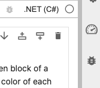
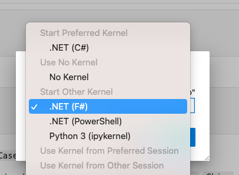
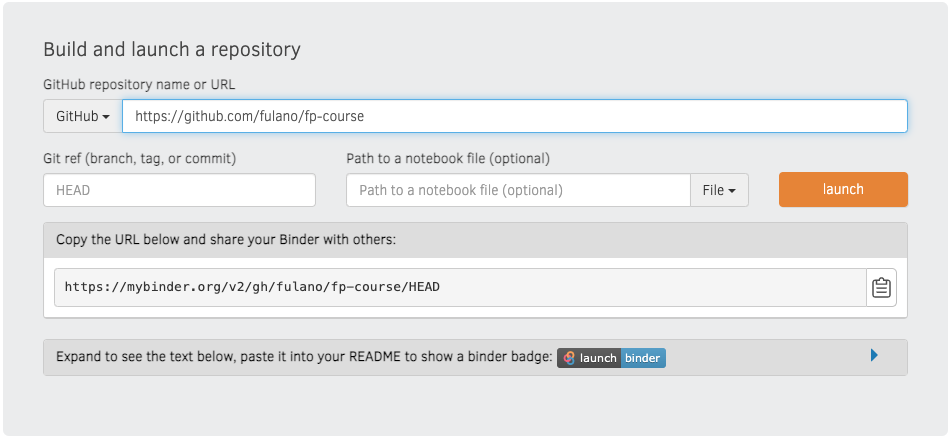

Te damos la bienvenida al curso de _Programación Avanzada_ del Instituto Balseiro. En este sitio encontrarás el material del curso (a veces en castellano, a veces en inglés). El único requisito es estar familiarizado previamente con algún lenguaje de programación.

El curso apunta a exponer al estudiante a un lenguaje de programación funcional. En esta versión del curso, se utiliza [F\#](https://learn.microsoft.com/en-us/dotnet/fsharp/what-is-fsharp). Sin embargo, no se trata exclusivamente de un curso para aprender un lenguaje, ya que visitaremos otros aspectos de la programación que son relevantes y pueden practicarse con cualquier lenguaje. Tocaremos algunos temas de diseño de software y de técnicas de programación. Por otra parte, repasaremos fundamentos formales de la programación funcional, para poner en contexto este paradigma.


## Aspectos prácticos

### Links

La documentación del curso está [acá](https://tinyurl.com/ibadv).

Para empezar, podemos programar en F# en [Fable Repl](https://fable.io/repl/).

### `Git`

Para participar activamente del curso, es necesario tener una cuenta en [GitHub](www.github.com). Tanto la entrega de ejercicios como el feedback sobre los mismos se realizará en esa plataforma, utilizando la aplicación `git`. Si bien el cursado de la materia requerirá sólo los comandos básicos, puede resultar útil tener más conocimiento 
del tema. [Acá](https://happygitwithr.com/) se puede encontrar una guía completa sobre `git`. 

> Una vez que se cree el usuario en GitHub, envíe esa información a flavio.colavecchia@ib.edu.ar así se le incluye en el curso. 

> Si no le gusta usar la terminal, puede descargarse [GitHub Desktop](https://desktop.github.com/). Veremos su uso en clase.

### Editor

Para cualquier lenguaje moderno es necesario contar con un editor potente que permita manejar las distintas capacidades de edición actuales. Tanto [Visual Studio Code](https://code.visualstudio.com/download) como [JetBrains Rider](https://www.jetbrains.com/rider/) son los editores recomendados. 
Mientras que el primero ofrece un entorno local y  [una versión web](https://vscode.dev/) que no requiere de instalación; el segundo es un editor pago, pero que [puede usarse gratis para educación](https://www.jetbrains.com/community/education/#students). 

> En el curso usaremos [_Notebooks_](#jupyter-notebooks), de modo tal que ser recomienda utilizar Visual Studio Code.


### Textos

Eventualmente se pedirá la entrega de algún ejercicio escrito que no sea un programa. Para ello utilizamos [Markdown](https://www.argentina.gob.ar/contenidosdigitales/escribir-en-markdown/markdown-basico) que posee una sintaxis simple, aunque permite agregar ecuaciones 
```latex 
$$f(g(x)) = g(x)+1$$
``` 
que se ven así:
$$f(g(x)) = g(x)+1.$$


### Videos

En este momento del siglo XXI, no hay manera de escapar a la información que viene en videos. [Aquí](https://youtube.com/playlist?list=PLnMc6Rr34vPYU5liVvEL_irif5XJQoBpK) hay una lista de videos asociados a los temas de la materia.


## Jupyter notebooks

> Veremos esto a partir de la clase 1.

El curso está estructurado como una colección de [Jupyter Notebooks Políglotas](https://devblogs.microsoft.com/dotnet/announcing-polyglot-notebooks-harness-the-power-of-multilanguage-notebooks-in-visual-studio-code/).
Un [Jupyter Notebook](https://jupyter.org/) es una aplicación sencilla que permite ejecutar bloques de código en celdas, que pueden entrelazarse con texto, gráficos, matemáticas, etc. El cuaderno se conecta a un _kernel_ que se encarga de ejecutar el código, y se ejecuta en un navegador web. El lenguaje más popular utilizado en los notebooks es Python, sin embargo, se pueden usar muchos lenguajes diferentes. Un cuaderno políglota incluye la posibilidad de ejecutar varios lenguajes, entre ellos F#.


### Inicio rápido

Para ejecutar las lecciones tal como están, simplemente abre este repositorio en MyBinder:

[](https://mybinder.org/v2/gh/fcolavecchia/fp-course-public.git/main?labpath=es%2F00_Index.ipynb)

Dale un poco de tiempo y esto abrirá los cuadernos en tu navegador web.

Abre el que prefieras, verifica que el `Kernel` en el lado derecho esté correctamente seleccionado:

Detectará automáticamente .NET C#, 



pero ese no es el lenguaje que estás buscando:



Y estás listo para comenzar.

### Haz tu copia (Fork it)

Si quieres experimentar con las guías, hacer los ejercicios, etc., es mejor obtener tu propia copia de este repositorio haciendo [fork](https://github.com/fcolavecchia/fp-course-public).

#### Usando Binder para ejecutar tu repositorio

Una vez que hagas fork del repositorio, ve a [MyBinder](https://mybinder.org/). Llegarás a esta página:





Copia la URL de tu repositorio bifurcado en el campo `GitHub`, y puedes dejar en blanco los campos `Git ref` y `Path to a notebook`. Haz clic en `launch`` y espera un momento hasta que MyBinder haga su magia.

Una vez abierto el Binder, haz clic en el directorio `es` (en español) o `en` (versión en inglés) en el panel izquierdo, y verás todos los cuadernos disponibles.

Sigue las instrucciones anteriores para seleccionar el kernel de F#.


<!-- El curso está editado en una serie de Jupyter notebooks, que permiten trabajar en forma interactiva. Si bien después de las primeras clases se recomienda instalar todo el _toolchain_  de aprendizaje y desarrollo localmente, se puede utilizar los contenidos
en [Binder](https://mybinder.org). Para ello:

- Con su usuario de GitHub, haga un _fork_ del repositorio [https://github.com/fcolavecchia/fp-course](). 

- Dirígase a My Binder ([https://mybinder.org/](https://mybinder.org/))

- Complete la información solicitada en My Binder. Por ejemplo, si el usuario de GitHub es `fulano`,
  entonces el nombre del repositorio será `https://github.com/fulano/fp-course`. Deje vacío el campo referido a `Git ref`, y el que define un notebook default. 

- Debería ver algo así:


- Listo, haga click en launch. Después de un rato podrá ver los notebooks en mybinder. El lenguaje 
  default es C#, por lo tanto es necesario cambiarlo en la esquina superior derecha de la página:


y elegir F#

. 

El resto es usar el notebook como en Python. -->


## Instalando el _toolchain_ 

Si bien en las primeras clases utilizaremos alguno de los entornos web para iniciarnos en la programación en F#, es conveniente ir acercándose 
al juego completo de herramientas. Para poder utilizar F# en Jupyter notebooks, [seguir estas instrucciones](https://marketplace.visualstudio.com/items?itemName=ms-dotnettools.dotnet-interactive-vscode) para instalar _Polyglot Notebooks_.

### Windows

Muy sencillo, las instrucciones están [aquí](https://learn.microsoft.com/es-mx/dotnet/core/install/windows?tabs=net80).

### Ubuntu 22.04

Para instalar el toolchain en ubuntu 22.04, es necesario [seguir algunos pasos detalladamente](https://learn.microsoft.com/en-us/dotnet/core/install/linux-ubuntu).

- Remover versiones anteriores de .NET instaladas quizás desde los paquetes nativos de ubuntu. 
- Como _Polyglot Notebooks_ es compatible con .NET 8.0, que [requiere ser instalada manualmente en esta versión de ubuntu](https://learn.microsoft.com/en-us/dotnet/core/install/linux-ubuntu#register-the-microsoft-package-repository).

<!-- ```bash
# Get Ubuntu version
declare repo_version=$(if command -v lsb_release &> /dev/null; then lsb_release -r -s; else grep -oP '(?<=^VERSION_ID=).+' /etc/os-release | tr -d '"'; fi)

# Download Microsoft signing key and repository
wget https://packages.microsoft.com/config/ubuntu/$repo_version/packages-microsoft-prod.deb -O packages-microsoft-prod.deb

# Install Microsoft signing key and repository
sudo dpkg -i packages-microsoft-prod.deb

# Clean up
rm packages-microsoft-prod.deb -->
```bash 
# Update packages
sudo apt update
```
<!-- La salida de todas estas instrucciones debiera parecerse a esto:

 -->


- Luego instalar el SDK con 

```bash
sudo apt install dotnet-sdk-8.0
```

- Finalmente, abrir VSCode e instalar la extensión Polyglot Notebooks. La misma extensión instalará una versión
  compatible de .NET interactive, que provee los _kernels_ de .NET para Jupyter.


## Cronograma

0. Intro a la programación funcional
    - Nociones básicas de F\#, inmutabilidad, tipos básicos.
    - Ejemplos de funciones
    - Composición
    - Aplicación parcial

<!-- 1. Tipos 
    - Instalación de herramientas.
    - Tipos algebraicos
    - Tipo Suma, _Discriminated Unions_
    - Tipo Producto, _Records_ 
 -->
<!-- 3. Control de flujo
    - La expresión `if`
    - Más sobre _pattern matching_ 
    - Recursión     

4. Colecciones
    - Colecciones heterogeneas: tuplas
    - Colecciones homogeneas: listas, `seq`
    - _List comprehension_     

5. Dojo    

6. Tipos genéricos    
    - Option
    - Result 

7. Misc
    - IO
    - Units of measure
    - Excepciones 

8. .NET
    - Organizando el código en módulos, proyectos y soluciones
    - Testing 
 -->


