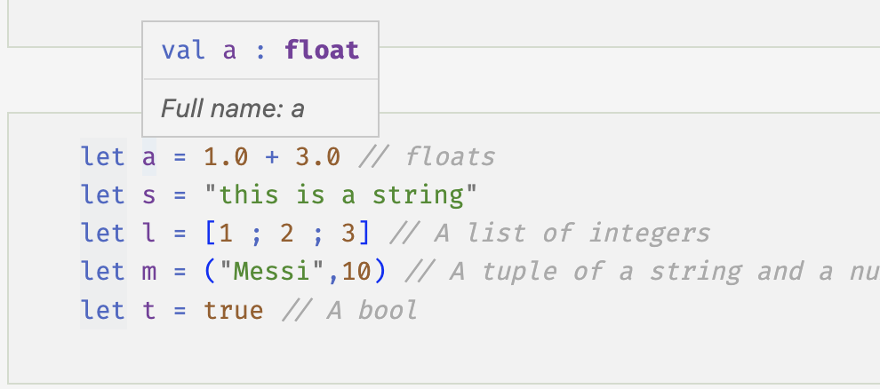
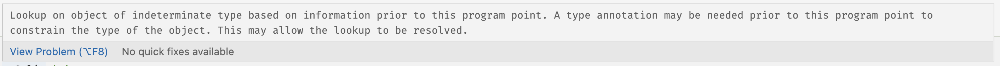
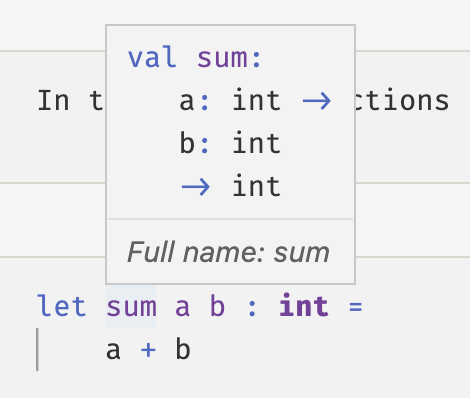

## Pensar con tipos

Para definir completamente una función, no solo necesita establecer su comportamiento, sino también sus entradas y salidas. ¡Para eso están los _tipos_!

## Tipos en el mundo real

Hemos cubierto los conceptos básicos de las funciones en F\# y hemos definido algunas propiedades que las diferencian de las rutinas o procedimientos en otros lenguajes. También hemos visto cómo se pueden combinar funciones. Ese es el primer aspecto sobre la definición de funciones: cómo se comportan y cómo se puede encapsular este comportamiento en una o varias funciones que se pueden componer para generar resultados. En nuestro ejemplo, el comportamiento de nuestra `VendingMachine` es darle algún producto una vez que proporcionó suficiente dinero y seleccionó su regalo con un teclado.
El segundo aspecto que es _necesario_ para definir la función es qué tipo de entradas y salidas tiene. Volviendo a nuestro primer ejemplo, uno tenía una tabla que representaba la función `carColor`, con el color de cada coche estacionado en una cuadra. Una función completamente diferente sería `carHorsePower`, donde para cada automóvil en la cuadra, escribe la potencia. Claramente aquí las entradas de ambas funciones son las mismas, la matrícula, pero las salidas son diferentes. Si nuestra máquina expendedora no acepta billetes en papel sino tarjetas de crédito, la entrada será diferente, pero aún obtendrá sus queridos chips, es decir, las salidas de `vendingMachine` y la moderna `vendingMachineWithCreditCard` son del mismo tipo, pero el las entradas son diferentes

Luego, para definir completamente una función, necesita especificar (codificar...) el comportamiento de la función _y_ los tipos de entradas y salidas. Estas son las dos caras de la misma moneda, y una no puede vivir sin la otra. Y ahí es donde el código debe representar correctamente el tipo de entradas y salidas del mundo real. Y ahí es donde el lenguaje te proporciona las herramientas para definir estos tipos.

¿Cómo definir el tipo de entradas y salidas de sus funciones? Para empezar, normalmente se escribe una lista con viñetas de todas las características relevantes de ellos. En el caso de los colores de los autos en el cuadra, las entradas son las matrículas que generalmente son letras y números, por lo que en nuestro modelo de código, eso sería una especie de cadena de caracteres. ¿Qué hay de las salidas? Se pueden usar los nombres de colores habituales, como hicimos nosotros. Eso estaría representado por una colección de `strings`.

> O, uno puede obtener más detalles y usar los nombres de los colores [que tiene cada modelo de automóvil](https://www.caranddriver.com/features/g28196287/wildest-paint-colors-for-sale/). Esa sería una colección de colores más completa, pero esto también afectaría las entradas de nuestra función, porque ahora también necesitamos el nombre del modelo de automóvil. Yendo más allá, el nombre del color probablemente cambie con los años del modelo, por lo que también lo necesitaríamos.

> ❓ ¿Se te ocurren las entradas y salidas de una función `carModel`? Esta función identifica el modelo de un automóvil en la cuadra. Comience con una descripción mínima y luego entre en más detalles.

> ❓ Tome los ejemplos del mundo real de las funciones que anotó en el capítulo anterior e intente definir sus entradas y salidas.


Para nuestra máquina expendedora, nuestras entradas van a ser el número de billetes de cada denominación introducidos en la máquina, y una letra y un número para determinar qué producto quiere el cliente:

- Número de billetes de cada denominación
- Una letra
- Un número

 Las salidas son posibles los productos, que se pueden modelar de forma minimalista diciendo

- La marca del producto
- El tipo de producto (chocolate, papas fritas, etc.)

y también una cantidad de billetes si la máquina da cambio.

Si tenemos una máquina expendedora con tarjetas de crédito, nuestra entrada será ligeramente diferente, ya que necesitamos modelar una tarjeta de crédito con

- Nombre del titular del coche
- Número de tarjeta
- Fecha de caducidad
- Número CVV

Un _tipo_ es la herramienta que proporcionan los lenguajes informáticos para agrupar o agregar las propiedades del modelo de cualquier entidad de nuestro dominio. Como todos sabemos, las computadoras solo entienden los bits 0 y 1 en el nivel más bajo, sin embargo, se presentan típicamente como fragmentos _bytes_ de 8 bits cada uno. Juntando bytes se pueden tener los tipos básicos de todos los lenguajes, como números enteros y flotantes en todas sus variaciones (enteros con o sin signo, enteros de diferente tamaño, números flotantes de diferentes tamaños). Otros tipos básicos, como cadenas o caracteres, incluso booleanos, dependen de la forma en que cada idioma los implemente.

Todos los lenguajes contemporáneos pueden construir tipos compuestos usando estos tipos básicos. Por ejemplo, si necesitamos modelar una billetera, necesitaremos una forma de representar billetes, tarjetas de crédito, identificación personal, etc. Cada uno de estos elementos a su vez también debe modelarse, y así sucesivamente. Por lo tanto, la billetera se representará como una agregación jerárquica de modelos más simples que, en el fondo de la misma, recurrirán a tipos básicos.

También hay otro aspecto de modelar las entidades del mundo real con tipos. Volvamos a nuestros ejemplos y examinemos cómo podemos mapear cada una de las propiedades de nuestros modelos en tipos más simples. Claramente, el nombre del titular de una tarjeta de crédito puede ser una cadena de caracteres, la fecha de vencimiento es, bueno, una fecha.
¿Qué tal el tipo de producto? En principio también puede ser una cadena de caracteres también. Sin embargo, parece que uno puede ser más específico: para una máquina expendedora de alimentos, se puede hacer una lista de los posibles tipos de alimentos:

- papas fritas
- chocolate
- caramelos

etcétera. También hay máquinas expendedoras de productos electrónicos, por lo que habría que

- teléfono
- parlantes
- auriculares
etc.

La lista puede ser larga, pero probablemente uno pueda escribirla en una página (o tal vez la proporcione el cliente de su máquina expendedora).

Parece que uno puede clasificar las características de las entradas y salidas de manera más amplia. Por un lado, el nombre del titular de una tarjeta de crédito y las fechas de vencimiento son collecciones enormes que no se pueden determinar _a priori_. Por otro lado, tenemos algunas características que pertenecen a un grupo bien predefinido de diferentes casos (colores de automóviles, tipos de productos). Tenga en cuenta también que estos dos tipos de tipos pueden combinarse en entradas o salidas, como en el modelo de billetera.

Una de las mejores características de F\# es que proporciona formas precisas de implementar estos dos tipos. En las próximas secciones veremos cómo construir estas entradas y salidas en F\#.

Por cierto, la palabra clave que usa F\# para construir tipos complejos es, por supuesto, `type` ;-D.

## Anotación de tipos e inferencia de tipos

Hemos definido livianamente algunos valores antes:

```C#
let a = 1.0 + 3.0 // floats 
let s = "this is a string" 
let l = [1 ; 2 ; 3] // A list of integers 
let m = ("Messi",10) // A tuple of a string and a number 
let t = true // A bool 
```

que, excepto por el uso de la palabra clave `let` (¡y el hecho de que son inmutables!), puede resultar bastante familiar, por ejemplo, para Python: uno usa el nombre del valor, el signo igual y la expresión que asignarse al valor en el lado derecho. ¡No hay declaración de _qué tipo_ es el valor! Pero ya dijimos que el lenguaje usa tipos estáticos, entonces, ¿cómo sabe el lenguaje qué tipo tiene cada valor?

Si pasa el mouse sobre cada uno de los valores anteriores, puede ver algo como esto:




Ese cuadro contiene el tipo del valor `a` que ha sido _inferido_ por el compilador. Sí, cuando codifica en un IDE compatible con F\#, habrá un compilador de F\# que digiere su código a medida que lo escribe y explora con qué tipos está trabajando. En la gran mayoría de los casos, la suposición del compilador es correcta. Hay algunos casos en los que no puede inferir el tipo del contexto de su código. En ese caso, verá algunas ondulaciones rojas que subrayan su variable y un mensaje de advertencia:




eso dice exactamente eso: el compilador no sabe qué tipo necesita asignar al valor problemático.

Entonces, en general, uno no define explícitamente los tipos de los valores, y esa tarea se delega al compilador detrás de escena. Sin embargo, uno puede anotar el tipo como:

```C#
let aa: float = 1.0 + 3.0 // floats 
let ss: string = "this is a string" 
let ll: int list = [1 ; 2 ; 3] // A list of integers 
let mm: string * int = ("Messi",10) // A tuple of a string and a number 
let tt: bool = true // A bool 
```

Uno usa la anotación `:<type>` para definir los tipos de cada valor. Para definir el tipo de output en el caso de las funciones, también se usa `:<type>` justo después de definir todas las entradas:

```C#
let sum a b : int = 
    a + b 
```

Una mirada más cercana a la función anterior nos lleva a otra notación interesante. Al pasar el cursor sobre `sum` vemos:



El compilador nos dice que la función `suma` es del tipo
```fagudo
int -> int -> int
```
es decir, recibe dos `int`s como entrada y devuelve un `int` como salida. Solo necesitábamos escribir explícitamente la salida de la función, y el compilador determinó que ambas entradas son `int`s. Esto se debe a que el operador de suma `+` necesita dos valores del tipo _mismo_, y no hay una promoción implícita de tipos en el lenguaje:

```C#
let si = 2 + 3 
let sf = 2 + 3.0 
```


    input.fsx (2,14)-(2,17) typecheck error The type 'float' does not match the type 'int'


    input.fsx (2,12)-(2,13) typecheck error The type 'float' does not match the type 'int'


> 🔔 Mirando la firma `int -> int -> int` de la función `sum` no parece claro cuáles son las entradas y cuáles las salidas. Por la definición de la función sabemos que recibe dos entradas y devuelve otra, pero la firma es completamente ajena a esto y usa el mismo símbolo `->` entre todos los tipos. ¿Podría `sum` ser una función que recibe un `int` y devuelve `int -> int`, que en sí mismo es una función? La respuesta es sí, y se llama _currying_.
Volveremos más tarde a curry cuando revisemos las funciones.

También se pueden definir tanto los tipos de entrada como los de salida de la función:

```C#
let sumf (a:float) (b:float) : float = 
    a + b 
```

Los paréntesis se utilizan para asociar cada valor de entrada con su tipo. No es necesario anotar todas las entradas de una función, solo aquellas que confunden al compilador o a su compañero desarrollador, o solo a usted en el futuro.

### El tipo `unit` y un primer contacto con los efectos secundarios

La lista de todos los tipos básicos en F\# se puede encontrar [aquí](https://learn.microsoft.com/en-us/dotnet/fsharp/language-reference/basic-types). Además de los habituales `bool`, `char`, `string` y todos los diversos números numéricos, hay uno que se llama `unit`.

El tipo `unit` tiene solo un valor posible `()`, y se usa para representar que no hay ningún tipo.

Aunque pueda parecer oscuro al principio, el lenguaje proporciona esta característica para tratar, por ejemplo, con esas cosas que suceden en el código que no devuelve nada. Por ejemplo, la función `printfn`:

```C#
let q = printfn "I am printfn "
printfn "and I do return unit: %A" q
```

    I am printfn 
    and I do return unit: ()


Aquí asignamos el resultado `printfn` al valor `q`, y luego imprimimos su valor, que es `()`. Tenga en cuenta que la función `printfn` se imprime en la consola, casi como cualquier función de impresión en la mayoría de los idiomas.

Además, uno puede tener una función que no tiene ninguna entrada:

```C#
let ohMy () =
    "ohMy"    
```

La función `ohMy` solo define la cadena "ohMy", y no necesita recibir nada como entrada.

En general, el tipo `unit` es una pista típica de que estamos lidiando con algún _efecto secundario_. Por ejemplo, imprimir algo en la consola _no_ es el resultado de la función `printfn`, sino un efecto secundario: la función hace algo que altera lo que sucede en la consola. Su código se ocupa de sus propios asuntos, pero en algún momento decidió mostrar cierta información en la consola. Pero su código no es el programa de la consola, no tiene nada que ver con él, excepto que _puede_ escribir cosas en la consola. Ese es un efecto secundario: algo que hace su código que no pertenece al ámbito en el que está trabajando el código.

Todos los datos que produce su código tendrán la forma de algún efecto secundario: imprimir en la consola, guardar en una base de datos, crear un archivo, enviar un correo electrónico, etc. Además, todos los datos que usa su código provienen de alguna parte: un archivo, la entrada del usuario en un teclado, una url, etc. Cualquier programa útil resultará en algún efecto secundario. Por lo tanto, aunque la programación funcional tiene que ver con funciones, en algún momento necesita tener herramientas para recibir o devolver datos del mundo. Esos son efectos secundarios _deseados_, probablemente escritos en alguna forma de especificación de su aplicación.

Lo que hace la programación funcional es brindarle todas las herramientas para evitar efectos secundarios _no deseados_ en su código, pero para producir efectos secundarios _deseados_ cuando sean necesarios. Por ejemplo, una función particular en su código recibirá algunas entradas inmutables y producirá algunas salidas nuevas. Entonces, si uno restringe la atención a esa función, cualquier cosa fuera de su mundo permanece sin cambios, pero se crea un nuevo valor (la salida).

En lenguajes no funcionales, el efecto secundario no deseado más común es poder cambiar los valores de entrada en una función. En la mayoría de los casos, estos lenguajes tienen la capacidad de pasar argumentos a una función como referencia (un puntero en C, por ejemplo) para que uno pueda cambiar los valores de la misma, lo que a su vez cambiará el valor de la variable del argumento. O uno puede cambiar el valor de una variable global dentro de una función. Esto hace que la depuración sea mucho más difícil y que el código sea mucho más difícil de mantener.
