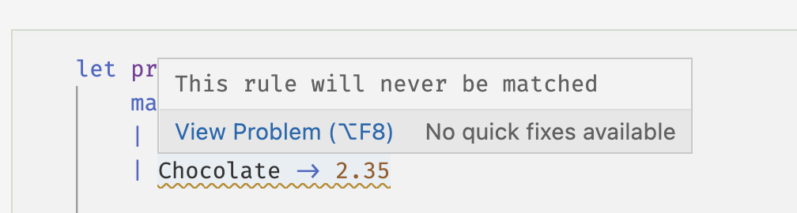

Uno de los aspectos clave de F\# (y otros lenguajes funcionales) es que proporciona una sintaxis específica para modelar aquellas características de entradas y salidas que pertenecen a una colección bien predefinida. Estos se llaman uniones discriminadas (_discriminated unions_).

El tipo para nuestra `VendingMachine` de comida sería:

```fsharp
type FoodProduct =
    | Chips
    | Chocolate
    | Candy 
```

mientras que para la electrónica podríamos tener:

```fsharp
type Electronics = 
    | Phones
    | Speakers
    | Headphones
```

> 🔔 Se acostumbra usar `PascalCase` para tipos (es decir, `FoodProduct`).

> ❗️ Los tipos de casos en una unión discriminada deben comenzar con una letra mayúscula (`Phones`, `Chips`, etc.).

En las expresiones anteriores estamos definiendo un tipo con un nombre (`FoodProduct`, `Electronics`) que puede tener varios tipos de casos. Es importante recalcar que los casos de cada tipo de unión discriminada son _disjuntos_, es decir, no se puede acceder al mismo tiempo. Por ejemplo:

```fsharp
let d = FoodProduct.Chips
let s = Electronics.Speakers
```

El lenguaje usa el punto `.` para representar un caso de unión discriminada. El valor `s` representa, por supuesto, un altavoz, y dado que es inmutable, no hay forma posible de que pueda ser un teléfono o un auricular.

Entonces, ¿cómo podemos definir funciones con uniones discriminadas? Escribamos una función 'precio' que recibe una entrada de tipo `Electronics` y nos da el precio:

```fsharp
let price electronic = 
    match electronic with 
    | Phones -> 435
    | Speakers -> 29
    | Headphones -> 122

printfn "The price of speaker is: %A $" (price s)    
```

    The price of speaker is: 29 $


La forma en que uno puede desagregar los diferentes casos de una entrada que es una unión discriminada es a través de _coincidencia de patrones_ (_pattern matching_), representada por la construcción `match ... with` y luego, **todos** los casos posibles de la unión. La sintaxis es bastante sencilla: para cada etiqueta de caso de unión discriminada (después del signo `|` en la construcción) aparece la flecha `->` que indica el valor (un `int`) que devuelve la función en ese caso.

Tenga en cuenta también que la coincidencia debe contener _todos_ los posibles casos de la unión discriminada. Si uno está olvidando algún caso, el compilador nos lo informará con un subrayado ondulado en la coincidencia. Esto significa que la coincidencia de patrones es _exhaustiva_.

Otro aspecto muy importante de la coincidencia de patrones es que se evalúa _en el orden en que se escribe_.

Pero, ¿qué sucede si queremos escribir una función `priceFood` y asignar un precio de 1,5 a todos los artículos, excepto a los chocolates, que tienen un precio de 2,35? El lenguaje introduce el símbolo _comodín_ que coincide con _cualquier_ entrada en la construcción de coincidencia de patrones. El comodín está representado por el símbolo `_` (guión bajo):

```fsharp
let priceFood food = 
    match food with 
    | Chocolate -> 2.35
    | _ -> 1.5 

printfn "Chocolate: %A $" (priceFood FoodProduct.Chocolate)        
printfn "Chips: %A $" (priceFood FoodProduct.Chips)        
printfn "Candy: %A $" (priceFood FoodProduct.Candy)        
```

    Chocolate: 2.35 $
    Chips: 1.5 $
    Candy: 1.5 $


Aquí vemos la interacción entre la evaluación del orden de la coincidencia de patrones y el comodín. Estamos devolviendo valores específicos para _algunos casos_ (Chocolate), y asignamos un valor común para _el resto de los casos_. Cuando `priceFood` recibe un "valor" de comida, se compara primero con el caso de "Chocolate". Si no es chocolate, el patrón comodín lo captura. Considere el siguiente ejemplo:

```fsharp
let priceSale food = 
    match food with 
    | _ -> 1.5 
    | Chocolate -> 2.35

printfn "Chocolate: %A $" (priceSale FoodProduct.Chocolate)        
printfn "Chips: %A $" (priceSale FoodProduct.Chips)        
printfn "Candy: %A $" (priceSale FoodProduct.Candy)        
```

    Chocolate: 1.5 $
    Chips: 1.5 $
    Candy: 1.5 $


Bueno, ¡todo está "en oferta" a 1,5! Esto se debe a que el comodín captura _cualquier entrada_ y dado que es el primer _caso_, cualquier alimento tendrá ese precio.

Aquí nuevamente, el compilador detrás de escena viene a nuestro rescate. Le hará saber que no se alcanzarán algunas de las reglas de coincidencia de patrones:



### Combinando uniones discriminadas y tipos básicos

En muchos casos, la construcción de unión discriminada no es lo suficientemente general, por lo que se puede combinar con tipos básicos. Digamos que queremos identificar la marca de cada uno de nuestros artículos en las máquinas expendedoras. Dado que puede acomodar múltiples marcas de productos, decidimos que representamos la marca por una "cadena". Podemos expandir nuestro tipo de unión discriminada `FoodProduct` como:

```fsharp
type BrandedFood =
    | Chips of string 
    | Chocolate of string 
    | Candy of string 
```

Cada uno de los casos del tipo `BrandedFood` tiene ahora un _valor_ de tipo `string`. La unión discriminada utiliza la palabra clave `of` para asociar cada caso con cada tipo de valor. Uno puede definir identificadores para este tipo compuesto como:

```fsharp
let belovedChocolate = BrandedFood.Chocolate "Wonka"
let healthyChips = BrandedFood.Chips "NotALeis"
let sourCandy = BrandedFood.Candy "TearDrops"
```

En el ejemplo de la marca, elegimos combinar todos los casos con el mismo tipo básico, `string`. Pero, de nuevo, uno puede mezclar y combinar. Por ejemplo, un chocolate puede venir en diferentes presentaciones:

```fsharp
type ChocolatePresentation =
| Bar of float  // a chocolate Bar of a given weight
| Box of int // a package with a number of chocolate pieces    
```

O bien, si queremos modelar el cambio de dinero que la máquina expendedora devuelve al cliente, podemos definir un caso en el que se devuelve una cantidad real y otro que representa el hecho de que el cliente acaba de poner el dinero exacto en la máquina:

```fsharp
type Change =
| Amount of float
| NoChange
```

La coincidencia de patrones en funciones contra estas uniones discriminadas compuestas es nuevamente bastante simple. Para obtener la marca de un producto `BrandedFood`, podemos definir la función `marca`:

```fsharp
let brand product = 
    match product with
    | Chips p -> p 
    | Chocolate p -> p 
    | Candy p -> p  
```

```fsharp
printfn "Brand of belovedChocolate: %s" (brand belovedChocolate)
```

    Brand of belovedChocolate: Wonka


En esta función, cada caso tiene un valor asociado representado por el identificador `p`, que se _desenvuelve_ de la unión discriminada y se devuelve.

Otro ejemplo:

```fsharp
let changeValue change =
    match change with 
    | Amount money -> money
    | NoChange -> 0 

let c = Amount 3 

printfn "You are receiving %A $ as change" (changeValue c)
```

    You are receiving 3.0 $ as change


> Notar sobre cómo una unión discriminada que mezcla tipos básicos parece presentar una especie de divergencia en el código. El tipo `Change` combina un tipo `float` envuelto (con `Amount`) y un tipo de unión pura `NoChange`. Dado que las funciones deben tener tipos de entrada y salida específicos, cualquier función que reciba una entrada `Change` tiene que devolver una salida definida. Normalmente hay dos posibilidades. La primera es que la función _aplane_ las entradas (como en el caso de `changeValue`), donde se obtiene el valor flotante del dinero que recibe el usuario. La segunda corresponde a una función que promueve los tipos de entrada a otro: por ejemplo, el caso trivial sería una función que imprime la cantidad de dinero que recibe el cliente, `imprimeCambio: Change -> ()`, es decir, recibe un 'Cambio' y devuelve 'unidad'.
> Esta es una de las ideas clave detrás de la programación funcional, poder conectar diferentes tipos a través de funciones.

### Protección de entradas con uniones discriminadas únicas

El último, pero no menos importante, caso de uso de uniones discriminadas corresponde a aquellas que solo tienen un término. Digamos que necesitamos describir los modelos de los diferentes artículos en nuestra máquina expendedora de productos electrónicos. Una forma de hacerlo es usando una unión discriminada _única_ (_single discriminated union_):

```fsharp
type Model =
    | Model of string
```

Entonces, podemos definir diferentes modelos de artículos:

```fsharp
let yPhone = Model "Xtreme 3S"
let miniSpeakers = Model "Louder Pro"
```

Dado que la unión discriminada solo tiene un caso, hay una forma breve de desenvolver el valor que contiene:

```fsharp
let (Model yPhoneModel) = yPhone
printfn "The model of the yPhone is %A" yPhoneModel
```

    The model of the yPhone is "Xtreme 3S"


Parece que hay mucha pompa en estos tipos, ¿por qué no usar una 'cadena' más simple en su lugar? La respuesta está, de nuevo, relacionada con las funciones. Definamos la función `printModel` como:

```fsharp
let printModel (model: Model) =
    let (Model value) = model 
    printfn "The model is %A" value 
```

```fsharp
printModel yPhone
printModel miniSpeakers
```

    The model is "Xtreme 3S"
    The model is "Louder Pro"


La firma de la función `printModel` es `Modelo -> ()`, lo que significa que recibe un valor de modelo y devuelve la unidad. Dado que la entrada es un 'Modelo', no hay forma posible de que podamos pasarle una cadena simple. De esta manera, uno protege la entrada de la función de tal manera que tiene que ser del tipo exacto que decidimos, y nada más.

Debe señalarse que esto no es una validación, es decir, todavía se puede mezclar el significado de 'Modelo' construyéndolo con cualquier cadena, la única pieza de código que es la función 'printModel' está protegida por el único tipo de unión discriminada. Entonces, este tipo no reemplaza la validación, pero le brinda un código más limpio.

### Terminando

El tipo de unión discriminada en ambas variantes (simple y múltiple) es un aspecto clave de la programación funcional en F\#. La capacidad de describir colecciones bien predefinidas con un solo tipo simplifica los códigos y los hace robustos. La especificación exhaustiva de coincidencia de patrones (supervisada por el compilador F\# entre bastidores) garantiza que el programador se ocupe de todos los casos de la unión discriminada y que no se deje ni un solo caso con posibles agujeros en el código.

El tipo de unión discriminada es la forma en que F\# representa un _tipo de suma_, como se llama a este tipo de tipos en la teoría algebraica de tipos.


