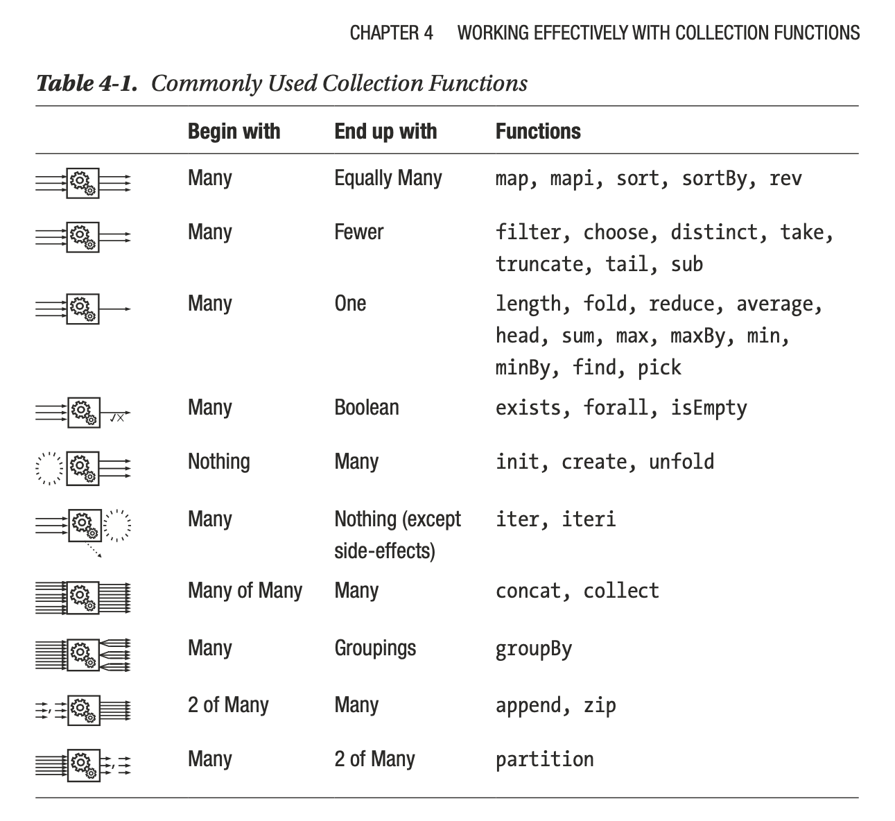

Hasta ahora hemos visto el tipo de colección `list`, que es esencialmente una lista simplemente enlazada. La definición de `list` es similar a la que propusimos con `MyList`, pero 

- es general para cualquier tipo de dato
- utiliza símbolos adecuados en lugar de etiquetas

```fsharp
type List<'T> = 
       | ([])  
       | ( :: )  of Head: 'T * Tail: 'T list
```

Como una lista es una unión discriminada, puede usarse tal cual cualquiera de ellas. Por ejemplo, se puede escribir [una función para imprimir los elementos de una lista](https://fsharpforfunandprofit.com/posts/match-expression/):

```fsharp
// loop through a list and print the values
let rec loopAndPrint aList =
    match aList with
    // empty list means we're done.
    | [] ->
        printfn "empty"

    // binding to head::tail.
    | x::xs ->
        printfn "element=%A," x
        // do all over again with the
        // rest of the list
        loopAndPrint xs

loopAndPrint []        
```

```fsharp
let l = [1;2;3]

l |> loopAndPrint

```

Se puede acceder a distintos elementos de la lista a través de índices, aunque su uso no es generalizado. Si se utilizan las funciones `Head` y `Tail` para encontrar el primer elemento y el resto de la lista:

```fsharp
printfn "%A" l.Head
printfn "%A" (l |> List.head)
printfn "%A" l.Tail 
printfn "%A" (l |> List.tail) 
```

Acá podemos ver dos variantes de estas funciones:
- Aquellas del tipo `List.` que provienen del módulo de listas de F#,
- _Métodos_  que un tipo de dato `list`. 

En el caso de los métodos, vemos cómo F# provee también características asociadas a la programación orientada a objeto. 

Hay que prestar atención a que una lista pueda ser vacía, porque en ese caso estos métodos devuelven una excepción:

```fsharp
printfn "%A" [].Head 
```

```fsharp
printfn "%A" [].Tail
```

### Procesando listas

Como venimos insistiendo, la idea de las colecciones es poder procesarlas a través de un función, o una serie concatenada de funciones (usando _piping_) de forma tal de poder obtener el resultado adecuado. 

Vimos que las funciones sobre colecciones se pueden clasificar de acuerdo al tipo de inputs y outputs de cada una de ellas. Detallando esta idea, en la siguiente imagen se ven algunos ejemplos de ellas, y qué tipos de inputs y outputs poseen (del libro [Stylish F#, de Kit Easton](https://link.springer.com/book/10.1007/978-1-4842-7205-3)):




La mayoría de estas funciones reciben como argumento una función y una lista, y devuelven una lista nueva con la transformación correspondiente. La función en general suele escribirse como una función anónima:

```fsharp
fun arguments -> expression
```

también conocidas como funciones _lambda_. 

Trabajemos con un ejemplo para ir incorporando este concepto. Para ello, usaremos un par de tipos de datos `Position` y `Player` que describen algunas características de un jugador de fútbol: 

```fsharp
type Position = GoalKeeper | Defender | Midfielder | Forward 

type Player =
    {
        Number: int 
        Name : string
        Team: string 
        Position: Position 
        Age: uint8 
    }
```

Obviamente, el ejemplo seguirá usando los siguientes ⭐️⭐️⭐️ : 

```fsharp
let champions2022 = [// Los 3 arqueros de Argentina en Qatar 2022
    {Number = 23; Name = "Emiliano Martínez" ;  Team = "Aston Villa"; Position = GoalKeeper; Age = 30uy};
    {Number = 12; Name = "Gerónimo Rulli" ;  Team = "Villarreal"; Position = GoalKeeper; Age = 30uy};
    {Number = 1; Name = "Franco Armani" ;  Team = "River"; Position = GoalKeeper; Age = 36uy};
    // Los 9 defensores de Argentina en Qatar 2022
    {Number = 26; Name = "Nahuel Molina" ;  Team = "Atlético de Madrid"; Position = Defender; Age = 24uy};
    {Number = 4; Name = "Gonzalo Montiel" ;  Team = "Sevilla"; Position = Defender; Age = 25uy};
    {Number = 13; Name = "Cristian Romero" ;  Team = "Tottenham"; Position = Defender; Age = 24uy};
    {Number = 6; Name = "Germán Pezzella" ;  Team = "Betis"; Position = Defender; Age = 31uy};
    {Number = 19; Name = "Nicolás Otamendi" ;  Team = "Benfica"; Position = Defender; Age = 34uy};
    {Number = 25; Name = "Lisandro Martínez" ;  Team = "Manchester United"; Position = Defender; Age = 24uy};
    {Number = 8; Name = "Marcos Acuña" ;  Team = "Sevilla"; Position = Defender; Age = 31uy};
    {Number = 3; Name = "Nicolás Tagliafico" ;  Team = "Olympique de Lyon"; Position = Defender; Age = 30uy};
    {Number = 2; Name = "Juan Foyth" ;  Team = "Villarreal"; Position = Defender; Age = 24uy};
    // Los 8 mediocampistas de Argentina en Qatar 2022
    {Number = 7; Name = "Rodrigo De Paul" ;  Team = "Atlético de Madrid"; Position = Midfielder; Age = 28uy};
    {Number = 5; Name = "Leandro Paredes" ;  Team = "Juventus"; Position = Midfielder; Age = 28uy};
    {Number = 20; Name = "Alexis Mac Allister" ;  Team = "Brighton"; Position = Midfielder; Age = 23uy};
    {Number = 18; Name = "Guido Rodríguez" ;  Team = "Betis"; Position = Midfielder; Age = 28uy};
    {Number = 17; Name = "Alejandro Gómez" ;  Team = "Sevilla"; Position = Midfielder; Age = 34uy};
    {Number = 24; Name = "Enzo Fernández" ;  Team = "Benfica"; Position = Midfielder; Age = 21uy};
    {Number = 14; Name = "Exequiel Palacios" ;  Team = "Bayer Leverkusen"; Position = Midfielder; Age = 24uy};
    {Number = 16; Name = "Thiago Almada" ;  Team = "Atlanta United"; Position = Midfielder; Age = 21uy};
    // Los 6 delanteros de Argentina en Qatar 2022
    {Number = 11; Name = "Ángel Di María" ;  Team = "Juventus"; Position = Forward; Age = 34uy};
    {Number = 22; Name = "Lautaro Martínez" ;  Team = "Inter"; Position = Forward; Age = 25uy};
    {Number = 9; Name = "Julián Álvarez" ;  Team = "Manchester City"; Position = Forward; Age = 22uy};
    {Number = 21; Name = "Paulo Dybala" ;  Team = "Roma"; Position = Forward; Age = 29uy};
    {Number = 15; Name = "Ángel Correa" ;  Team = "Atlético Madrid"; Position = Forward; Age = 27uy};
    {Number = 10; Name = "Lionel Messi" ;  Team = "París Saint-Germain"; Position = Forward; Age = 35uy};
]
```

Definamos una función que nos permite recorrer la lista e imprimirla. Para eso usamos `List.iter` que, justamente, itera la lista y devuelve `unit`: 

```fsharp
let almostPrettyPrintList l = 
    l 
    |> List.iter (fun elem -> printfn "%A" elem)
```

```fsharp
champions2022 
|> List.sortBy (fun p -> p.Number)
|> almostPrettyPrintList
```

#### Interpolated strings

No es muy compacto... Podemos crear una función que nos permita imprimir el dato de cada jugador en forma más elegante. Vamos a usar _interpolated strings_ para hacerlo. Un _interpolated string_  es una cadena de caracteres que comienza con el símbolo `$`, y tiene el texto entre comillas dobles. En su interior se pueden usar los valores entre llaves `{}`. 

```fsharp
let toStringPlayer player = 
    $"{player.Number}: {player.Name} ({player.Age}), {player.Position}, juega en {player.Team}"


let prettyPrintList l = 
    l
    |> List.iter (fun p -> printfn "%s" (toStringPlayer p))  

prettyPrintList champions2022       
```

La lista se puede ordenar:

```fsharp
champions2022 
|> List.sort 
|> prettyPrintList
```

Vemos que la lista aparece ordenada primero por número. En este caso, `List.sort` utiliza un comparador genérico para saber qué elemento está antes que otro. Sin embargo, la lista se puede ordenar de acuerdo a algún criterio usando `List.sortBy`:

```fsharp
champions2022 
|> List.sortBy (fun p -> p.Age)
|> prettyPrintList
```

Quizás uno no necesita imprimir todos los datos de cada jugador:

```fsharp
champions2022 
|> List.sortBy (fun p -> p.Age)
|> List.map (fun p -> $"{p.Name} tiene {p.Age} años")
|> List.iter (fun s -> printfn "%s" s)
```

Se puede buscar algún elemento de la lista con alguna característica particular:

```fsharp
champions2022
|> List.find (fun p -> p.Age = 21uy)

```

Nótese que `List.find` devuelve el primer elemento que encuentra. Si uno quiere todos los elementos que comparten una cierta característica, usamos `List.filter`

```fsharp
champions2022
|> List.filter (fun p -> p.Age = 21uy)
```

```fsharp
let arqueros = 
    champions2022
    |> List.filter (fun p -> p.Position = GoalKeeper)

prettyPrintList arqueros    
```

Podemos usar otros métodos para procesar los datos de la lista:

```fsharp
champions2022
|> List.averageBy (fun p -> p.Age)
```

Interesante, hay que convertir el dato a `float`:

```fsharp
champions2022
|> List.averageBy (fun p -> float p.Age)
```

Hay funciones que permiten procesar la lista, recolectando datos que poseen características similares.

```fsharp
champions2022
|> List.groupBy (fun p -> p.Team)
```

La función `List.groupBy` no devuelve una lista de jugadores, sino una lista de pares ordenados (tuplas), donde el primer elemento sería la llave común del tipo de dato recolectado, y el segundo elemento es una lista de elementos que corresponden a esa llave:

```fsharp
champions2022
|> List.groupBy (fun p -> p.Team)
|> List.iter (fun (team,l) -> 
                printfn "%s" team 
                prettyPrintList l
                )
```

Veamos cuántos jugadores aportó cada equipo:

```fsharp
champions2022
|> List.groupBy (fun p -> p.Team)
|> List.map (fun (t,l) -> (t, l |> List.length))

```

Este último procedimiento se puede resumir con `List.countBy`:

```fsharp
champions2022
|> List.countBy (fun p -> p.Team)
```

Se puede construir un histograma de edades:

```fsharp
champions2022
|> List.groupBy (fun p -> p.Age/5uy * 5uy)

```

```fsharp
champions2022
|> List.groupBy (fun p -> p.Age/5uy * 5uy)
|> List.map (fun (t,l) -> (t, l.Length))
|> List.sort 
```

La función `List.partition` nos permite agrupar los elementos en dos listas con características disjuntas:

```fsharp
champions2022
|> List.map (fun p -> (p.Name,p.Age))
|> List.partition (fun (name,age) -> age < 30uy)


```

```fsharp
let menoresde30, mayoresde30 = 
    champions2022
    |> List.map (fun p -> (p.Name,p.Age))
    |> List.partition (fun (name,age) -> age < 30uy)

printfn $"Los menores de 30 son {menoresde30.Length}"
printfn $"Los mayores de 30 son {mayoresde30.Length}"
```

Finalmente, algunas funciones nos permiten evaluar una determinada característica de una lista:

```fsharp
champions2022
|> List.forall (fun p -> p.Age < 30uy)
```
